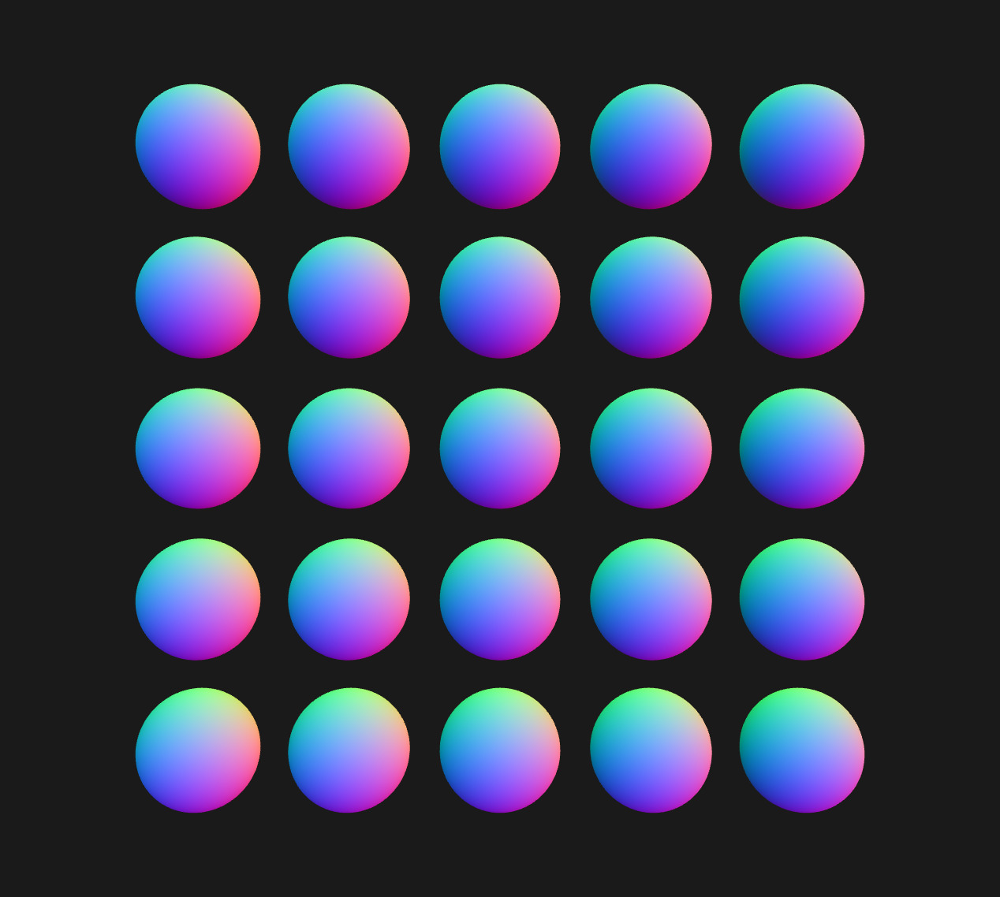
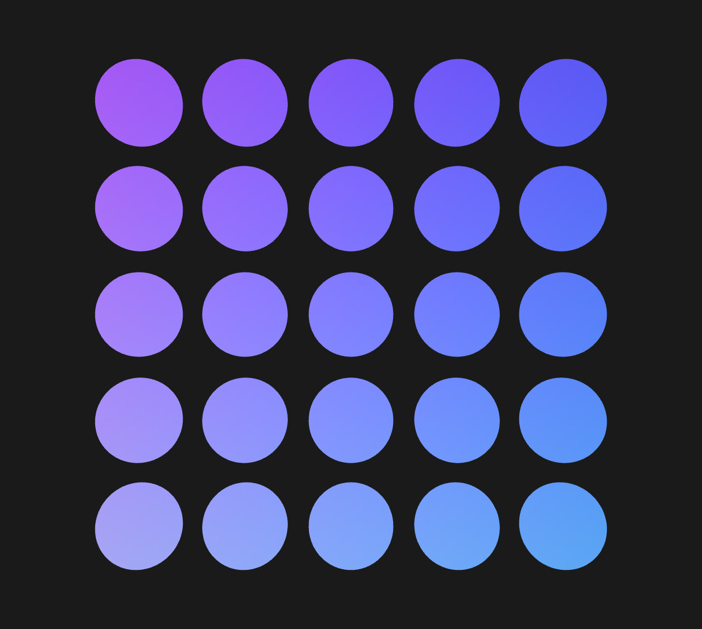
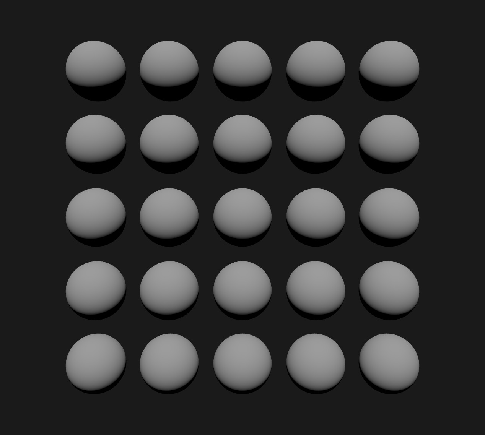
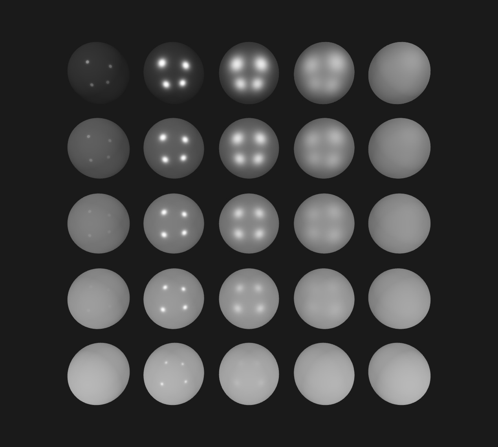
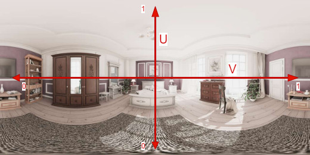
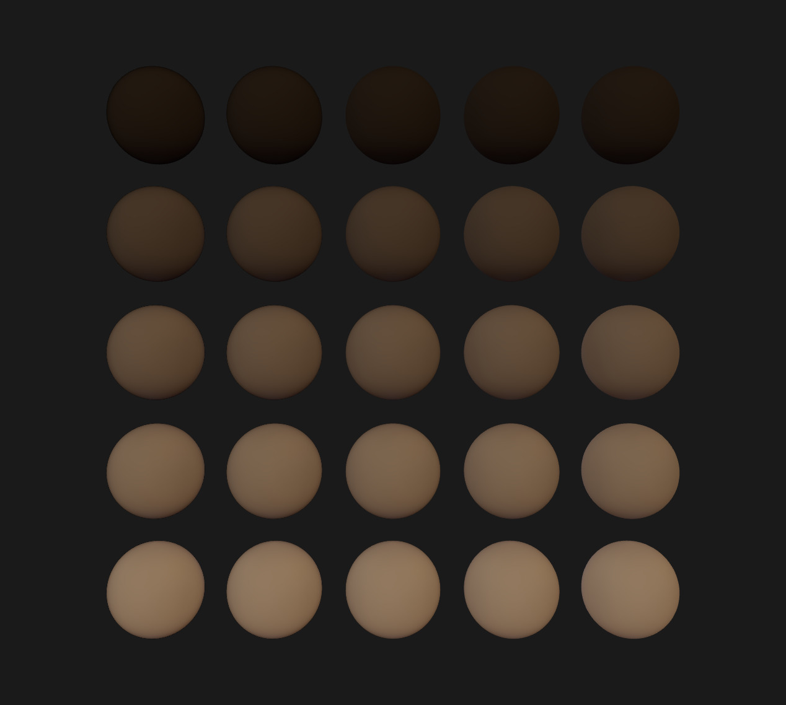
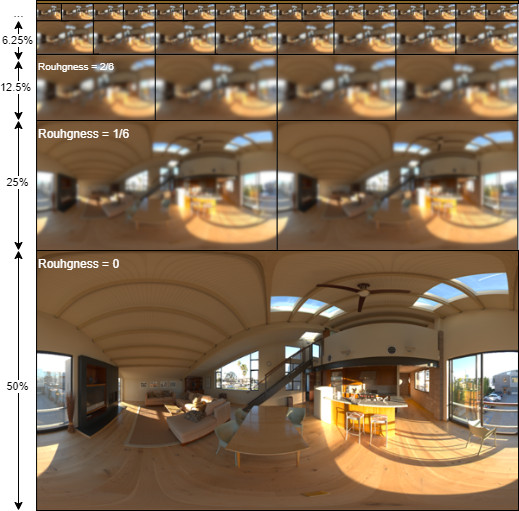
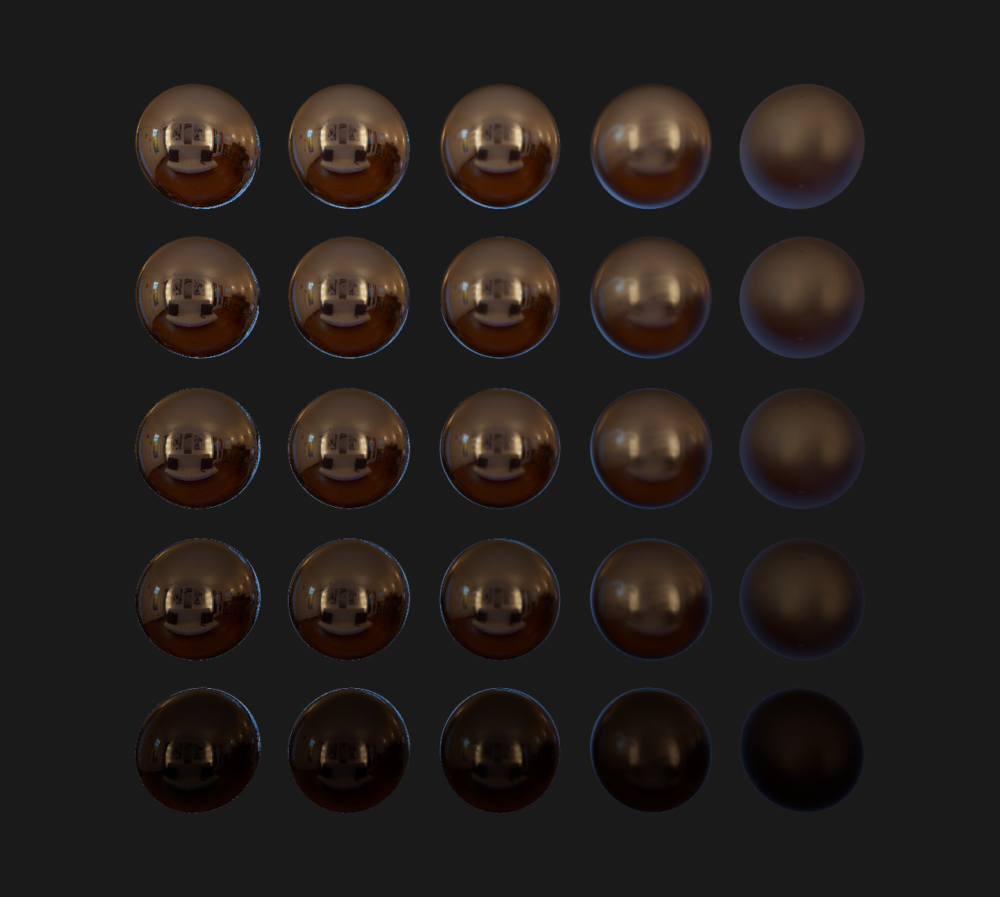
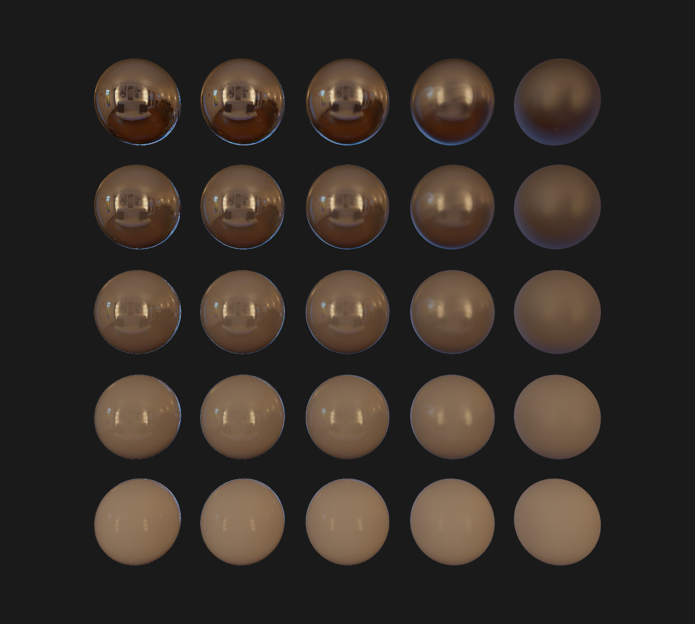

# Physically Based Rendering (PBR)
The goal of this project is to implement a PBR renderer. You are asked to implement:
* A Lambertian diffuse BRDF
* A Cook-Torrance GGX specular BRDF


## Grading
* Group size: **1**
* Due date: 17/10/2024, 23h42
* Format: TODO


## Installation
After cloning the repository, install the dependencies using:

```sh
yarn # Alternatively you can run `npm install`
```


## Running
You can start the development server using:

```sh
yarn dev # Alternatively you can run `npm run dev`
```

You can now reach [localhost:8080](http://localhost:8080) to try your code.
The development server supports Hot-Reload, which means that when saving your code, the page
will automatically auto-reload with the latest changes.


## Provided Code

### Index
The [index](./src/index.ts) is the entry point of your application. The game loop is started there
and resources are initialized in the `Application` class.

In this repository, I created a simple shader that sets a uniform color on a triangle. This sample
will help you start to implement your PBR shader.

### Context
The [context](./src/gl.ts) is one of the most important. It abstracts WebGL calls and resources management.
Without that, you would need to spend quite a bit of code to setup:
* Geometries (Vertex Buffers)
* Textures
* Shaders
* etc...

I didn't want you to spend your time writing an abstraction, so I made one for you. If you want fancier features, please feel free to update it with your own changes.

For the most curious ones, the file uses `WeakMap` (basically hash tables) to retrieve uploaded GL objects from your own instances (textures, geometries, etc...).

### Shader
The [Shader](./src/shader/shader.ts) just contains the two shaders (vertex and fragment) as strings.
It also contains a dictionnary (`defines`) that can allow you to conditionnally compile code or not.

When working on big rendering project, we often want several versions of a same shader with some differences.
Using `#define`, we take advantage of the preproccessor to compile different variants.

The values in the `defines` dictionnary will basically be preprended to your shader before compiling it.


## Tooling
[Spector.js](https://chrome.google.com/webstore/detail/spectorjs/denbgaamihkadbghdceggmchnflmhpmk?hl=en) is a chrome extension that will help you analyze data sent to webgl, visualize framebuffers, etc... The best debugging tool for WebGL!


## Assignment
You are free to proceed the way you want. However, I would advise you to
go step by step and ensure intermediate results are correct. Otherwise, you will spend time
trying to figure out why your specular is off, when the issue might actually come from a different part of the pipeline.


### Warm up (0 points)
This short part will help you discover the code. It will be used in the next section, so don't skip it.
1. Draw the `NormalWS` vector (the fragment's surface normal in World-Space). This kind of vector is in the [-1, 1] range. To reinterpret it as a color, we usually remap to [0, 1].
2. Draw the `ViewDirectionWS` vector (the direction from the fragment to the camera, in World-Space). As for the normal, don't forget to remap it in [0, 1].

Here is an example of what you should see:
| NormalWS | ViewDirectionWS |
| :------: | :-------------: |
|   |   |


### Direct Lighting (2 points)
Implement point lights, use at least 2 in your scene.
Send simple light data to the shader (color, intensity, position or direction), compute their attenuation and display them.
The file `light.ts` already contains some of the code needed.

In addition, you can also implement directional lights if you want.


### Tone mapping (1 point)
Implement the Reinhard tone mapping to convert your HDR lighting to LDR.
All the screenshot examples following this exercise are using the Reinhard tone mapping.
However, for better-looking results, I would advise implementing [ACES](https://knarkowicz.wordpress.com/2016/01/06/aces-filmic-tone-mapping-curve/) instead.


### Diffuse BRDF (1 point)
Implement the Lambertian diffuse BRDF.

This is the kind of results you should get with a directional light:
<p align="center">

</p>


### Specular BRDF (6 points)
Implement the Cook-Torrance GGX specular BRDF.

This is the kind of results you should get with 4 point lights:
<p align="center">

</p>


### Image-Based Lighting
For the Image-Based Lighting, the given textures are encoded in **RGBM** (Red, Green, Blue, Multiplier). It allows to encode HDR colors using only 8 bits per channel (through a bit of quantization). A naive floating-point encoding would use 32 bits per channel, which means 4 times more memory used on disk and VRAM. To store the multiplier channel on 8 bits too, we use a constant range multiplier of 6.

Floating-point compression is a wide subject which I encourage you to [read more about](https://www.khronos.org/opengl/wiki/Small_Float_Formats). However this is not our topic here, so you can use the following function in order to map **RGBM** values to **RGB**:
```glsl
vec3 RGBMDecode(vec4 rgbm) {
  return 6.0 * rgbm.rgb * rgbm.a;
}
```


#### Image-Based Lighting: Diffuse (2 points)
The tasks to accomplish to lit your objects with the diffuse IBL are:
1. Load one of the diffuse files provided in the folder `assets/env`
2. Use the geometry normal to sample the texture. Be careful here, the texture is saved as an [equirectangular projection](https://en.wikipedia.org/wiki/Equirectangular_projection).
   1. Start by converting your normal from cartesian coordinates to polar coordinates, using the following function:
      ```glsl
      vec2 cartesianToPolar(vec3 cartesian) {
          // Compute azimuthal angle, in [-PI, PI]
          float phi = atan(cartesian.z, cartesian.x);
          // Compute polar angle, in [-PI/2, PI/2]
          float theta = asin(cartesian.y);
          return vec2(phi, theta);
      }
      ```
   2. Obtaining equirectangular UV coordinates from polar coordinates is easy, you only need to remap from `([-PI, PI], [-PI/2, PI/2])` to `([0, 1], [0, 1])`.
      | Polar coordinates | UV coordinates |
      | :---------------: | :------------: |
      |  |  |
3. Compute the indirect diffuse BRDF using this irradiance

This is the kind of results you should get with the diffuse texture `Alexs_Apt_2k-diffuse-RGBM.png`:
<p align="center">

</p>


#### Image-Based Lighting: Specular (3 points)
For the specular IBL, the texture encodes different version of the environment for different roughness values. There is a total of **6** pre-computed roughness levels. The lowest roughness level is placed at the bottom of the texture, and occupies 50% of the total height (but 100% of the width). Each level is **half the size** of the previous one.

Here is a visual representation:
<p align="center">

</p>

Thus, you will need to deduce the correct UV coordinates from the roughness value.
In order to get proper blending, you are advised to sample two roughness levels simultaneously, and to blend them together.

The tasks can be summed up as:
1. Load one of the specular files provided in the folder `assets/env`
2. Convert the reflected ray from cartesian to polar
3. Offset the polar coordinates according to the roughness level
4. Repeat steps **2** and **3** for a second level
5. Fetch both levels and blend them together according to how far between the two the sample was
6. Load the texture `assets/ggx-brdf-integrated.png` containing the precomputed BRDF. This texture uses sRGB color space, don't forget to remap to linear color space.
7. Apply the result to the rendering equation using the pre-computed BRDF

This is the kind of results you should get with the diffuse texture `Alexs_Apt_2k-specular-RGBM.png`:
<p align="center">

</p>

Now that you implemented both the diffuse and the specular IBL, take a look at the combined results:
<p align="center">

</p>


#### Image-Based Lighting: Diffuse Generation (5 points)
Until now, you have worked with pre-computed IBL data. Instead of using the assets from the repository, try to generate yourself the baked environment textures.

In this steps, you are asked to write a fragment shader (compute shaders are not available in WebGL) to generate the convoluted diffuse.
> [!WARNING]
> Obviously, this should be done only once. You can do it when your application is starting up. A lag of a few milliseconds might occur, which is totally fine.

Steps:
1. Create a new shader that will convolute the environment diffuse.
2. Load the unfiltered environment texture in a `Texture2D<HTMLElement>` and upload it to the GPU.
3. Create a `Texture2D<PixelArray>` that will store the convolution result, and upload it to the GPU.
4. Create a framebuffer and bind it. Attach your created texture as the color output, using `setFramebufferTexture`.
5. Set the viewport correctly.
6. Launch a drawcall. The process should be executed in a fullscreen manner, using a triangle or a plane.
7. Reset the viewport and the bound framebuffer.
8. Use this result in your PBR shader.

I provided a few RGBM environment textures [on this drive](https://drive.google.com/drive/folders/1A725vJemn-aw1YuieIBqt-ST0Tae9Egp?usp=sharing).
Alternatively you can find IBL textures online (on [Poly Haven](https://polyhaven.com/hdris) for example). The `HDRtoRGBM.py` script will help you converting them from `.hdr` to RGBM `.png`.


## Bonus

### Other BRDF (0.5 points)
You can experiment with other BRDFs (diffuse or specular), such as:
* Burley
* Oren-Nayar
* Ward

Whatever you want to try!


### Textures (1.5 points)
PBR is meaningless without carefully authored textures bringing complexity to materials.

You can download some texture that would map well to a sphere, such as [those ones](http://freepbr.com/materials/rusted-iron-pbr-metal-material-alt/).


#### Image-Based Lighting: Specular Generation (8 points)
Just like you did for the diffuse, you can generate the specular probe. This task is harder, but will definitely make you stronger.

Please refer to the paper [Unreal paper](https://cdn2.unrealengine.com/Resources/files/2013SiggraphPresentationsNotes-26915738.pdf) for the implementation. Don't hesitate to come see me during the lesson so I can give you a detailed explanation about what you have to do.
