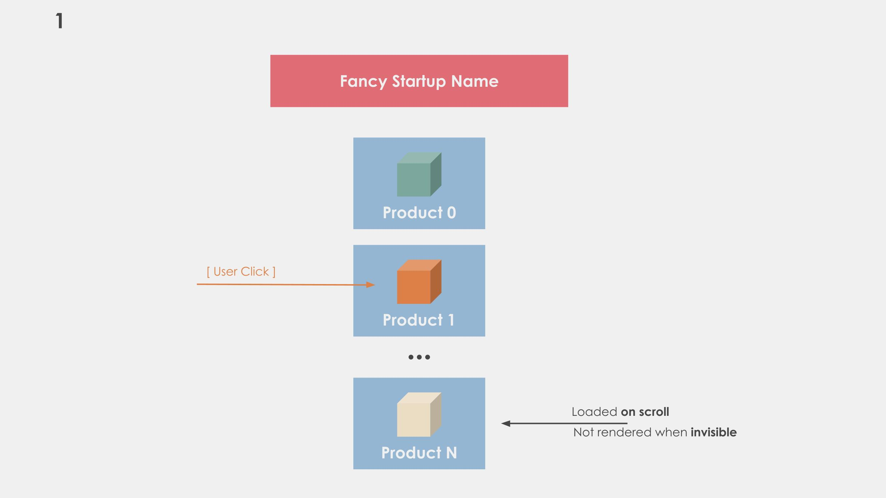
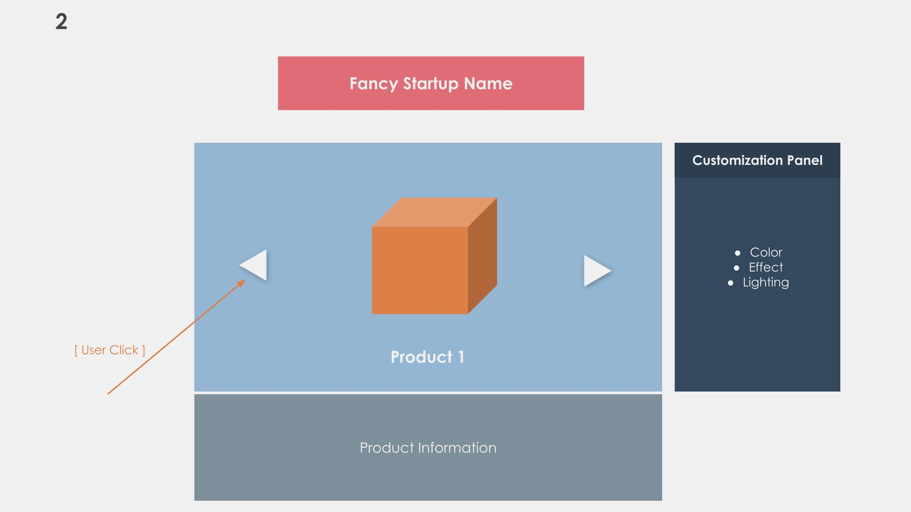
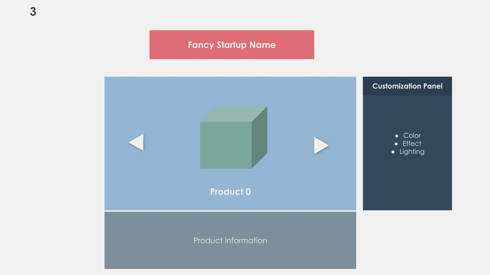

# Project: Next Generation Shopping

The goal of this project is to create the future of online shopping. It doesn't
sound exciting? Make it exciting then :)

For students that don't know what they want to do, this project can be a lot of fun and will make you use a lot of features we have seen together :)

## Information

* Done in group of **2 students**
  * Please let me know the name of the students in the README.md
* Submitted by the 5th of December at **23:42**
* Hosted if possible, so I can try it out easily :)
* You can't use [react-three-fiber](https://github.com/pmndrs/react-three-fiber)

You will need to submit the code as well, either by:
* Sending a zip
* Sending an hosted repository URL

You are free to design the website's layout / visual look the way you want.

There are only a few technical requirements that are asked, but the rest is up to **your choice**. Enjoy the project and try to be original!

> If you plan to make something super different and highly custom, maybe ask me first so we can see if it properly fits the project
> For instance, a group of student once made the entire project in 3D, with 0 CSS

For assets, you are advised to download free ones on:
* [Sketchfab](https://sketchfab.com/)
* [Sketchfab glTF Samples](https://sketchfab.com/features/gltf)
* [glTF Repository](https://github.com/KhronosGroup/glTF-Sample-Models/tree/master/2.0)

Please remember to always thank the author for providing you amazing free assets!

> P.S: I am OK to discuss with student that want to make a completely different project. However, we will need to discuss the scope of your project before to ensure it's not too hard nor too easy to achieve.

## Grade

As mentionned, the project should be submitted by the **5th** of December at **23:24**. Every minute late will result in a **-1 point** penalty.

The grade will be divided into **three** (no pun intended) categories:
* Mandatory Requirements
* Originality
* User Experience

If the website is dynamic, with smooth transition, fancy animations, you will
get the best possible grade. Obviously, it must be dynamic but **shouldn't**
affect negatively the user experience (e.g: waiting 10s for an animation to finish).

## Screens

Below is the list of screens that you will need to implement. you can either make a single page or multipage website.

The images shown in this section are purely here to help you visualize how
the website could look like. This doesn't mean you should take this exact
design or layout.

### Home Page

This page should display a list of products rendered in **3D**. When the user
selects a product, it should move on to the [Viewer Page](viewer-page).

You can either:

* Create a multi-page website, or simply create a single page
* Create a single-page website that's fully animated.
  For instance, when a product is selected, you could hide
  the list and smoothly modify the layout of the page.

The second option is harder, but will give you extra points if done correctly.

Be careful with one thing here. Because you can't create more than a
few `WebGLRenderer` per tab, you will need to:
* Create a hidden canvas and `WebGLRenderer`
* Render each item to the hidden canvas
* Copy the pixels from the hidden canvas to the product canvas using [Context2D.drawImage](https://developer.mozilla.org/en-US/docs/Web/API/CanvasRenderingContext2D/drawImage)

### Viewer Page

This page is used to display:

* Information about the product (you can put anything you want here)
* The [Edition Panel](#mandatory-edition-panel) used to see how the product would look like
  with different parameters
* Two buttons to be able to cycle through the previous / next product

Cycling through the product should be done entirely in 3D with a smooth
transition between the products.

## Mandatory: Navigation

* Home should display a scrollable list of product.
  * Data out of the screen shouldn't be loaded
  * Canvas out of the screen shouldn't be rendered
* User must be able to select a product and open it in a larger view
* When a product is selected, it should display its information as well
  as the [Edition Panel](#mandatory-edition-panel)
* In the viewer page, users should be able to cycle through products **without**
  going back to the scroll list
  * The transition should be smooth (e.g: fade in/out, slide in/out, etc...)
  * All products **shouldn't** be loaded simulatenously!
* There must be a way to come back to the scrollable list from the viewer page

## Mandatory: Edition Panel

You must provide an edition panel with the following features:

* Changing material color
* Any other cool options you want :)

## Mandatory: Viewer

I have purposely left out some mandatory viewer feature here because you should
know by now what kind of features can help make a 3D scene look good or not.

In addition to all the mandatory features listed below, your viewer **must**
look great. We have seen how some features can drastically improve your renders,
please use them to get the best possible outcome.

* Materials should be Physically-Based
  * If you want to mix in fake product for fun, you can use non-PBR materials
* After some time with no user inputs, the camera should smoothly rotate
  around the object to showcase it.
* Add annotations that allows user to get 3D information on mesh

For the annotations, you can get an example of things you should do [here](https://modelviewer.dev/examples/annotations/index.html#addHotspots).

For your annotations, you can display any text as a placeholder. They
do not need to become transparent when rotating around the model.

### Controls

When the user is in the viewer tab, he / she should be able to:

* Navigate around the object using mouse inputs
* Double click to focus a point on the object
  * You will need to figure out where the user clicked, and
    move the camera closer to focus this point

### Shadows

Your scene will need to have some real light shadows coming from a direction light, that:

* Create real-time shadows from directional lights
  * Independent on the scene scale
  * Have the least possible artefacts
  * Aren't **hardcoded** per objects!

> To increase realism, try to make your directional light match the main light coming
> from your environment. You are allowed to hardcode this.

### Post-Processing

You need to use properly at least **one** post-process. It's up to you to choose
what you want to do.

The goal is to make the final image look good. I recommend you to use:

* `SSAO`
* `Depth Of Field (DOF)`
* Eventually `Screen Space Reflection (SSR)`

You can either pick one, or even combine them to improve the results.
