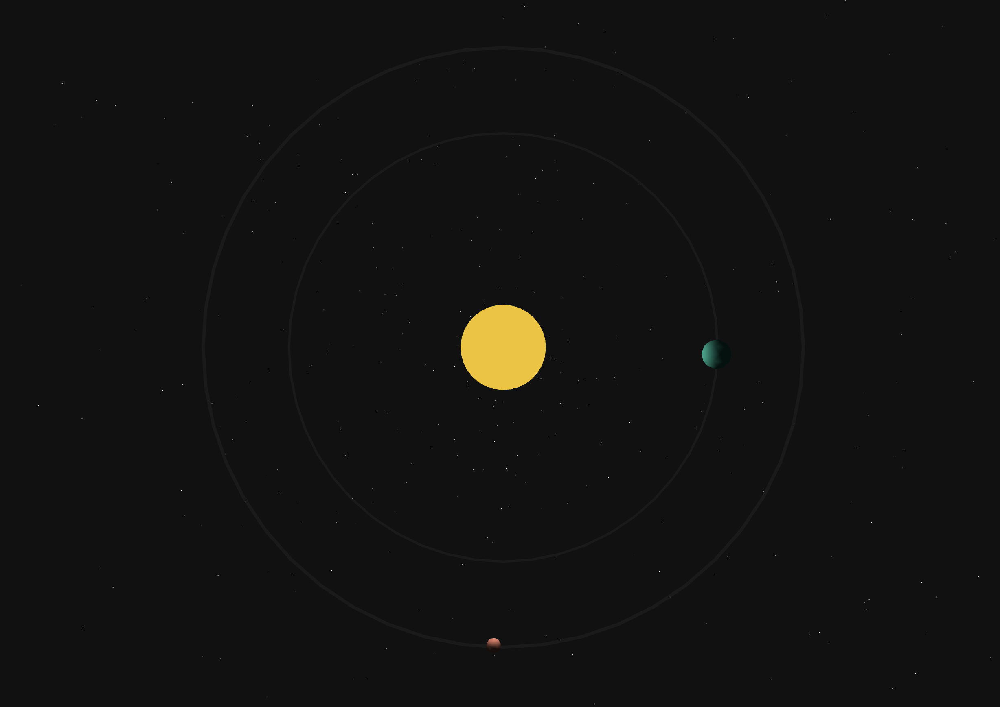
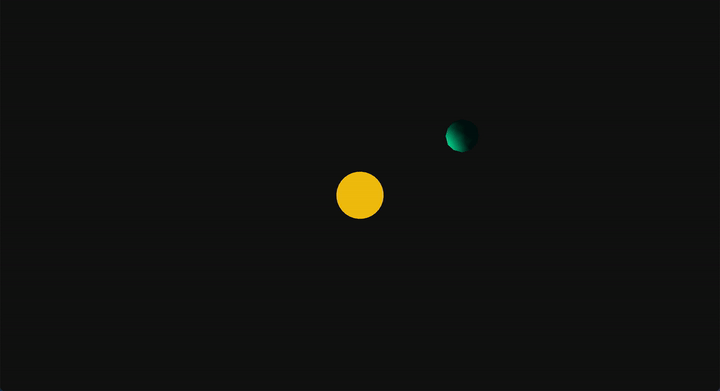
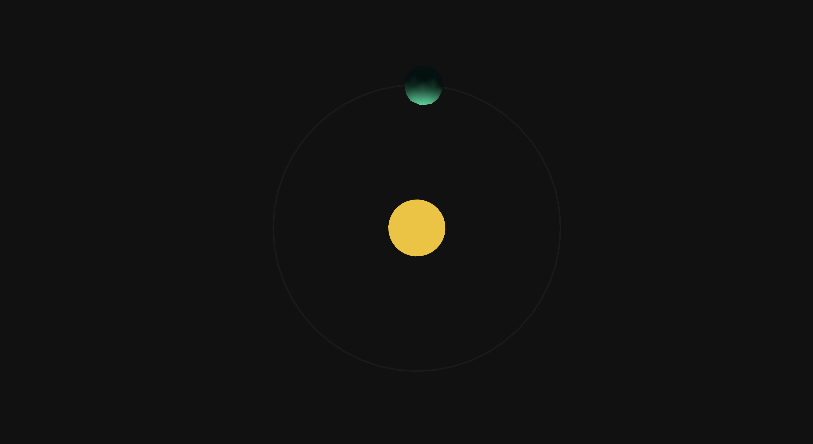
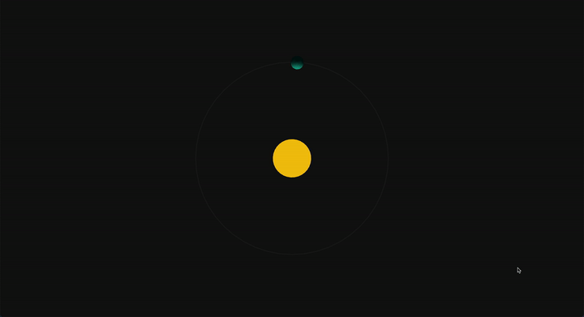
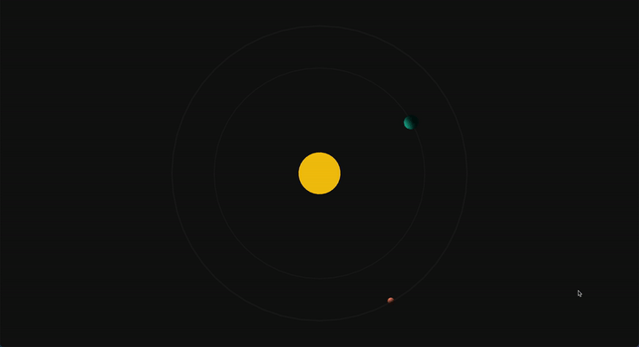
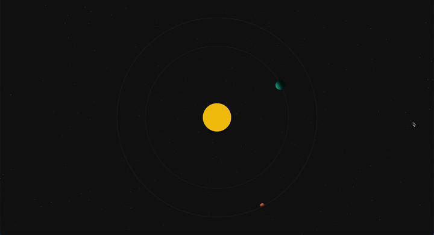

# TP 1: Solar System

## Threshold 1: Add Sun / Earth

For the first threshold, you are asked to simply:
* Create the sun with a `MeshBasicMaterial` at the center of the solar system
* Create a light that will be position at the sun center
* Create the Earth orbiting around its center and around the sun
    * Use something else than a `SphereGeometry` to see the object rotating
      around its center of mass
    * Use a material that reacts to light (`MeshLambertMaterial`)

The goal here is to manipulate the Scene and to take advantage of
the transform composition offered by the Scene Graph. Do not try
to do every transformation manually. You should try to model your scene
graph to simplify your problem.

> In real life, it's not always good to model a system as-is in
> the scene graph. You should always think about your use case, your
> data, and how it's transformed.
>
> However, this exercise is good for learning purposes.

You should obtain something similar to that:

## Threshold 2: Add Orbits

Add some orbit meshes that will show the trajectory of the Earth.

The inner part of the orbit **shouldn't** be visible. It's up to you to think about a solution on how to do that.

You should obtain something similar to that:

## Threshold 3: Add Controls

Hook some controls to manipulate the camera. The controls target should be setup
to focus at the center of the solar system.

You should obtain something similar to that:

## Threshold 4: Add Mars

The same way you added the Earth, you should add Mars and change its material
color.

You should obtain something similar to that:

## Threshold 5: Use dat.gui

In the base class `Example`, you will find a property name `_gui`. Have a look at
the [dat.gui](https://github.com/dataarts/dat.gui) documentation and create a GUI to:

* Change the speed of rotation of the solar system, the Earth, and Mars.
* Change the intensity of the light emitted by the Sun

From now on, dat.gui will be your best friend to quickly experiment and update properties :)

## Threshold 6: Improve!

The difference between a bad and a good 3D experience is often in little
improvements. Try to improve your scene to make it look better and less flat.

Example of possible improvements:
* Add stars
* Make the sun move like it's burning with multiple shapes
* etc...
