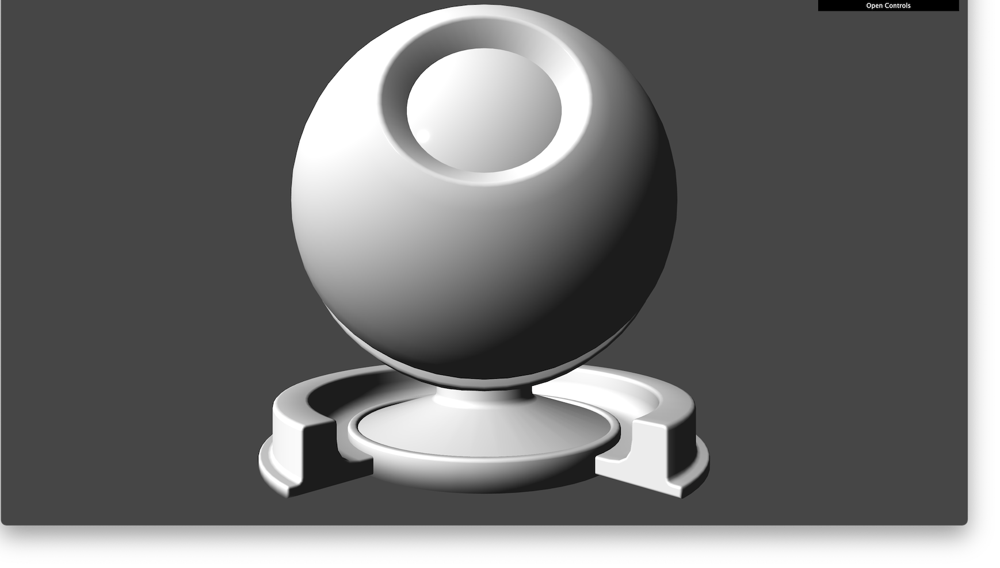
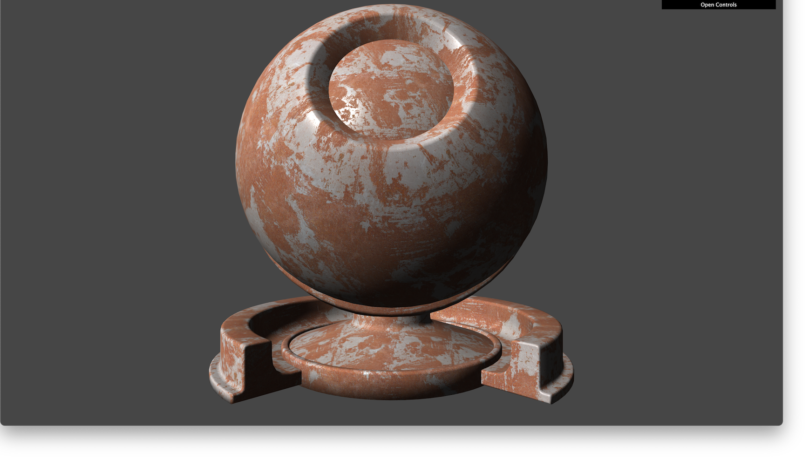
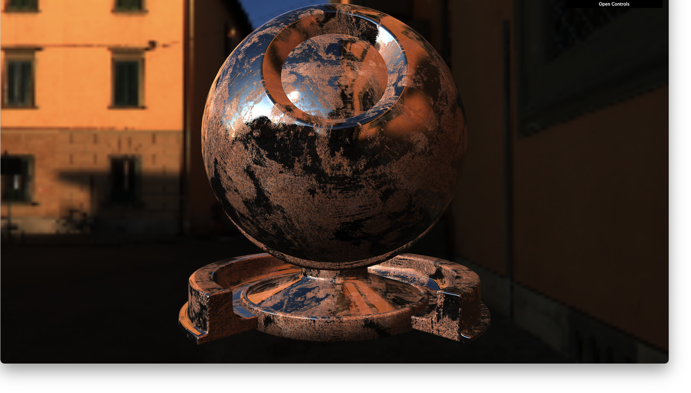
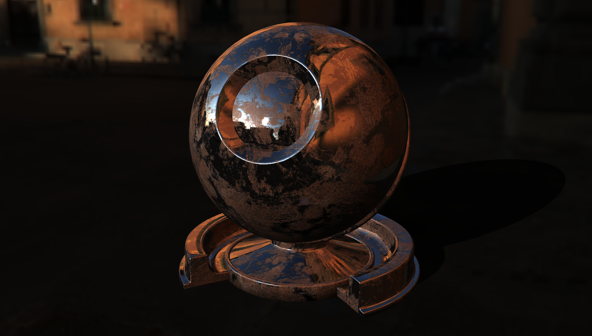
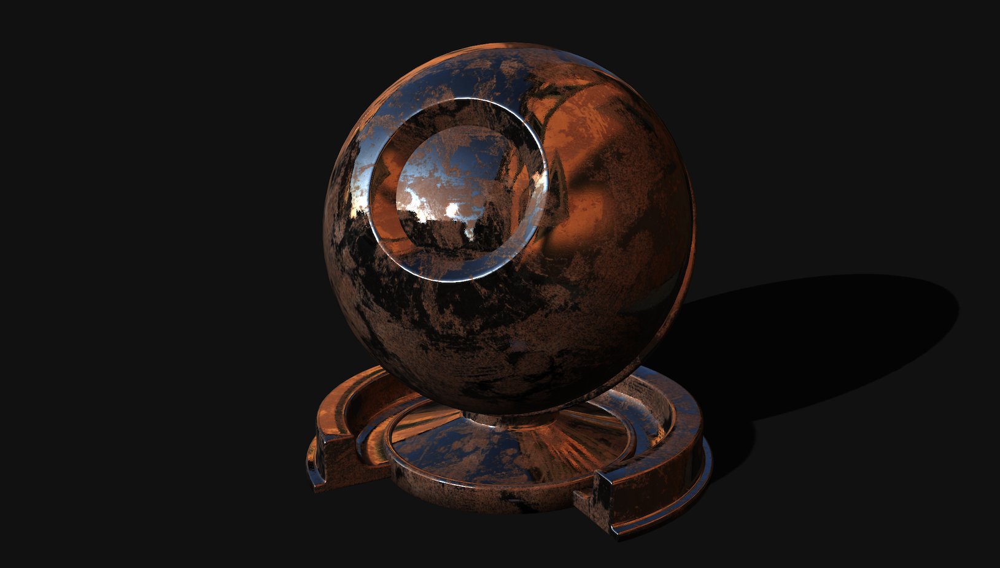

# TP 2: Mesh and Textures

## Threshold 1: Load OBJ

For the first threshold, you are asked to simply load the obj:

```
assets/models/material_sphere.obj
```

You should display the mesh with:

* Using a `MeshStandardMaterial` / `MeshPhysicalMaterial`
* A `DirectionalLight` and / or `PointLight`

You should obtain something similar to that:



## Threshold 2: Add Controls

Add the controls of your choice between
* `TrackballControls`
* `OrbitControls`

## Threshold 3: Load Textures

Load the files:

```
assets/textures/rust/albedo.png
assets/textures/rust/metallic.png
assets/textures/rust/normal.png
assets/textures/rust/roughness.png
```

> Please Ensures the loading isn't blocking, i.e., load all textures simultaneously and apply them when loaded

You should obtain something similar to that:



## Threshold 4: Load Environment

Load the environment

```
assets/env/pisa/*.hdr
```

and display it as a background.

You should obtain something similar to that:



## Threshold 5: Add Shadows

Add shadows coming from a `DirectionLight`. The scene should be setup as follow:

* `DirectionalLight` should mostly point in the same direction as the main light
  coming from the environment
* Shadows parameter should be optimal, i.e.: shadow should be soft and the shadow
  map should be used as efficiently as possible
* You must not hardcode the boundaries of your shadow camera parameters, but rather
  try to deduce them programatically

> For the last bullet point, please have a look at bounding boxes, i.e.,
> [Box3](https://threejs.org/docs/?q=box3#api/en/math/Box3)

You should obtain something similar to that:




## Threshold 6: Create a Grid

For this thresold, you are asked to create a grid of size 5 * 5. Basically,
you should display the same model in a grid, spaced uniformly.

Each model will have its own PBR material and you will modulate the **roughness** and **metalness**
properties gradually. Update the **roughness** in the x-direction, and update the **metalness** in the y-direction.

To sum up, the lower left model should have a roughness / metalness of **0**, while
the upper right model should have a a roughness / metalness of **1**.
Everything in-between will have an interpolated value of roughness / metalness.

## Threshold 7: Be Creative

With 3D, possibilities are (almost) endless :) Try to be creative
and to come up with original renders!
