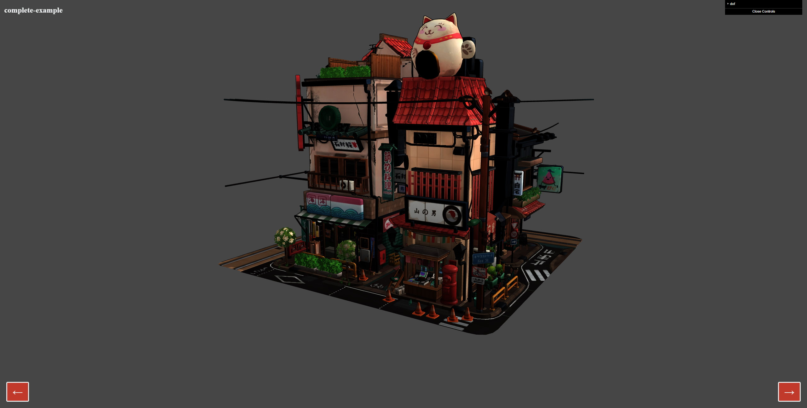
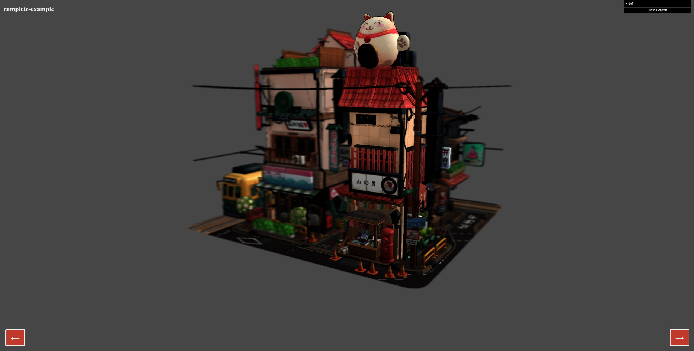
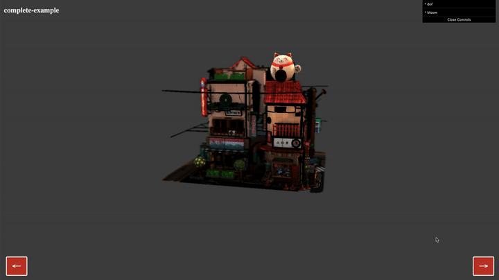

# TP 3: Make It Look Good

## Threshold 1: Load glTF

For the first threshold, you are asked to simply load the glTF file:

```
assets/models/LittlestTokyo.glb
```

Because the file is compressed, you will need to give Three.js the [draco](https://github.com/google/draco/tree/master/src/draco) library. Draco is a Google library
used for compression / decompression of meshes.

You can download the draco library files and place it in your static folder and give the path to Three.js.

You should obtain something similar to that:



## Threshold 2: Enable Animations

The model comes with an animation track. You need to enable it.

## Threshold 3: Debugging Parameters Visually

In order to debug, you should start using [dat.gui](https://github.com/dataarts/dat.gui).
It's a simple raw JS framework that allows you to quickly create UI to debug / modify your application
parameters.

All the assignment examples come with a `._gui` property, which is an instance of the
`GUI` object.

In order to understand how to use dat.gui, please have a look at their
[documentation](https://github.com/dataarts/dat.gui/blob/master/API.md).

This threshold isn't mandatory, but you will quickly see how painful it can be to change parameters
in the code versus tailoring them with the UI.

## Threshold 4: Depth of Field

In this threshold, you are asked to add some well-tailored Depth of Field.

You should obtain something similar to that:



## Threshold 5: Auto Focus DoF

Write some business logic to handle:

* Mouse movement
* Re-compute the focusing distance of the DoF when mouse move

You should obtain something similar to that:



## Threshold 6: Make It Look Good!

In this threshold, you are free to use anything we have seen
in the past to make your scene look good.

Be as creative as possible and try to make the scene look pro.
Be more creative than I was :)


